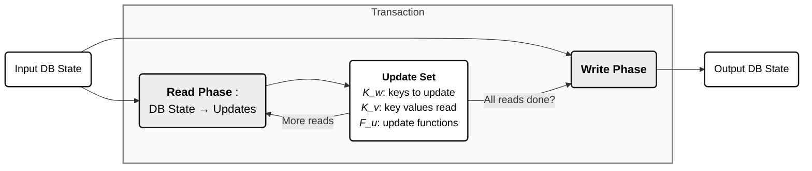

Transactions are a core feature of databases, but absent from mainstream programming languages.
<!-- Transactions are a defining feature of databases,  -->
Thus, many approaches to transactional programming in database systems often developed in a lineage somewhat distinct from the programming languages community.
 <!-- Similarly, transactional programming is traditionally not a common feature of most mainstream programming languages, whereas for databases it has been more or less assumed as table stakes.  -->
 This has led to a diverse set of transactional programming models, with many system or domain-specific approaches.
 We can examine a variety of these models that exist in practice, looking at both the underlying programming models and the dominant transactional systems that introduced them.
 <!-- / Since it is often the case that systems will introduce their own, somewhat custom or opinionated programming model, it is useful to look at these categorizations in terms of both the underlying abstract models and the dominant transactional database systems that introduced them. -->

 <!-- The use of [transactional memory abstractions](https://en.wikipedia.org/wiki/Software_transactional_memory) is a somewhat well explored research area, but is still an esoteric feature for mainstream programming language environments. -->


<!-- ## Programming Transactions -->

<!-- One key tradeoffs in transactional programming models is the "interactive" vs. "one-shot" or "batch" models. The former being naturally the more intuitive and natural way of programming with transactions for a user, but one-shot transactions potentially simplifying concurrency control mechanisms and/or boosting performance and cutting down round-trip latency between the client and server. -->

<!-- If we look at transactions from a programming language perspective, rather than a database or execution oriented perspective (e.g. a transaction that executes over many round trip interactions with a server),  -->


<!-- Note that some categorizations can be in terms of the system that introduced or makes use of them rather than the language or technique itself.  -->

### SQL

SQL is probably the most traditional and widely used transactional programming interface, as it is the de facto standard for interacting with most relational database systems. Running a simple interactive style transaction in SQL might look like the following, where standard SQL queries and updates can be wrapped inside a transactional block:

```sql
BEGIN TRANSACTION;

-- Deduct $150 from Account A
UPDATE Accounts
SET Balance = Balance - 150
WHERE AccountID = 'A';

-- Add $150 to Account B
UPDATE Accounts
SET Balance = Balance + 150
WHERE AccountID = 'B';

-- Commit the transaction if both operations succeed
COMMIT;
```
Notably, the ideas behind SQL itself weren't initially coupled with a transactional model. Codd's original [paper on the relational model](https://dl.acm.org/doi/10.1145/362384.362685) (1970) doesn't explicitly mention transactions or SQL, the language only later being introduced in [SEQUEL](https://dl.acm.org/doi/10.1145/800296.811515) (1974). Transactions seem to first appear most directly in the [System R](https://www.cs.cmu.edu/~natassa/courses/15-721/papers/p97-astrahan.pdf) work (1976), and over time became more intertwined with and a core feature of SQL.

Making SQL a more generic programming environment required later extensions. [PL/SQL](https://www.geeksforgeeks.org/sql/pl-sql-transactions/), first introduced around 1988 (Oracle v6), embeds standard sequential/imperative programming constructs into SQL. It extends classic SQL with loops, conditionals, error handling, and allows for transactions to be expressed in a *stored procedure* style. A simple stored procedure might look like the following:

```sql
DECLARE
     -- taking input for variable a
     a integer := &a ; 
      
     -- taking input for variable b
     b integer := &b ; 
     c integer ;
  BEGIN
     c := a + b ;
  END;
```
Similarly, [Transact-SQL](https://en.wikipedia.org/wiki/Transact-SQL) (T-SQL) was Microsoft's and Sybase's proprietary extension to SQL present in the late 1980s that introduced similar procedural programming constructs.

### Sinfonia

<a name="sinfonia"></a>

[Sinfonia](https://dl.acm.org/doi/10.1145/1294261.1294278) (SOSP 2007) was a research system that basically asked a question of what is the minimal primitive needed to build useful transactional applications. The ideas was to provide a single, *minitransaction* primitive on which to build more complex transactional applications or components. Essentially, this provides atomic access and conditional modifications at multiple memory nodes. It consists simply of a set of *compare items*, *read items*, and *write items*. Upon execution, if any comparison items fail to match the values specified, the transactions fails and aborts. 


It assumes this kind of low-level but sufficiently expressive primitive approach for building simple but scalable transaction systems. I'm not sure how ergonomic this interface is for developers, though, and what type of applications are willing to drop down to this lower level abstraction in practice. On the other hand, perhaps there are better programming interfaces/models that can be built on top of this, with tools for translation into these lower level primitive operations.


### Calvin

[Calvin](https://dl.acm.org/doi/10.1145/2213836.2213838) (SIGMOD 2012) was not directly a proposal for a transactional programming model itself, but relied on some core assumptions about the underlying model to make its key ideas work. In particular, it made assumptions that transactions were expressed as C++ functions that access data using a basic CRUD interface. This facilitates analysis of a transaction's full static read/write sets for deterministic scheduling and conflict avoidance. 

Transactions that must perform reads in order to determine their full read/write sets are not natively supported, but they can kind of work around this with *reconnaissance queries*, that run a first round of reads to determine these sets. The important aspect here, though, is the strong assumption on static read/write set analysis, which is often not easy in practice for transactions normally written in a dynamic/interactive approach.


### Fauna Query Language (FQL)

[FaunaDB](https://faunadb.org/), (now [defunct](https://news.ycombinator.com/item?id=43414742)), was an attempt at building a production-ready distributed database on many of the concepts from the Calvin and deterministic transaction ideas. The [Fauna Query Language ](https://faunadb-docs.netlify.app/fauna/current/learn/query/)(FQL) was a proprietary, TypeScript-like language they developed for reading/writing data in Fauna. The documentation on this is a bit thin these days, but it appeared that it was essentially a productized version of the ideas in Calvin, with a goal of making static analysis of read/write sets easier.

### Spanner

[Spanner](https://docs.cloud.google.com/spanner/docs/transactions) provides externally consistent (≈ strictly serializable) distributed transactions, where operations that occur in a read-write transaction are buffered at the client until commit, so reads will not observe the effects of the transaction's writes. Original versions of Spanner (as described in [OSDI 2012](https://static.googleusercontent.com/media/research.google.com/en//archive/spanner-osdi2012.pdf)) supported its own query language that was generally SQL-like.

Modern versions of Spanner also support a *[mutations](https://docs.cloud.google.com/spanner/docs/modify-mutation-api#python)* API, which is dedicated for writing data within transactions. They also include a dedicated language for manipulating data, [DML](https://docs.cloud.google.com/spanner/docs/dml-tasks). 


### MongoDB

For several years MongoDB has provided [multi-document transactions](https://www.mongodb.com/docs/manual/core/transactions/) that run at up to snapshot isolation. MongoDB provides a fairly standard, imperative style interface for programming with transactions, since transactional operations are expressed as standard CRUD queries within existing driver programming interfaces. So, this leads to a slightly more natural mapping to standard programming language constructs and control flow. 

```javascript
// Start transaction.
session.startTransaction();

db.collection.find({ _id: "123" })

// Update document.
db.collection.updateOne(
  { _id: "123" },
  { $set: { name: "John" } }
)

// Commit transaction.
session.commitTransaction();
```
There are also a few subtle interface choices one can make when programming in this manner, in particular with regards to how updates are expressed. For example, in general, you have access to the full feature set of the host programming language, and so could express updates in any way you might express mutation in that language. Alternatively, you can also represent updates more "natively" using MongoDB specific [update operators](https://www.mongodb.com/docs/manual/reference/mql/update/). This encodes the full semantic content of the update to the database in a more explicit way.


### DynamoDB

<a name="dynamodb"></a>

DynamoDB is a key-value store that recently [added support for transactions](https://www.usenix.org/system/files/atc23-idziorek.pdf) (USENIX ATC 2023).  They essentially adopt a truly "one-shot" model, which comes with some pros and cons.
All transactions are submitted as single request, using either a `TransactWriteItems` or `TransactGetItems` command. The general model of DynamoDB is basically a flat KV store, and you can set or update keys on a given table. A write-transaction can include, `PutItem`, `UpdateItem`, or `DeleteItem` as basic operations.

<div style="justify-content:center; gap:20px; padding-bottom:17px;">
  
  
</div>


A `TransactWriteItems` transaction may optionally include one or more preconditions on the current values of the items, and the transaction will be rejected if any of its preconditions are not met. These ideas are actually quite similar to the ones introduced in the [Sinfonia](#sinfonia) system, and is briefly referenced in their paper.

### Aurora DSQL

Amazon [Aurora DSQL](https://aws.amazon.com/blogs/database/everything-you-dont-need-to-know-about-amazon-aurora-dsql-part-3-transaction-processing/) is a serverless, distributed, transactional database system that was made generally available by AWS in 2025. 

They note the following about their transactional programming model and query processing engine, which provides snapshot isolation as the default:

> When write operations occur, the QP stores the results of these database changes locally, effectively spooling the writes throughout the transaction’s duration. In the event of a rollback or any disconnect, the QP discards the spooled writes.


This seems more similar to original Spanner read-write transactions, which buffered all writes at the client before submitting them to the server. 


### Convex

[Convex](https://docs.convex.dev/database/advanced/occ) is not a database, strictly speaking, but is rather a full end-to-end framework for building database-backed applications in a convenient, all-in-one package. All of your application and infra code and configuration is essentially bundled together in one place, which provides nice opportunities for easily co-designing and optimizing these components together. They take a quite [opinioniated view on things](https://stack.convex.dev/not-sql), but have put careful thought into how we might re-design modern application and data stacks without the baggage of (50 year old) SQL.

Their notion of transactions is called [mutations](https://docs.convex.dev/functions/mutation-functions) which are TypeScript functions that insert, update, or remove data from the database, and they execute transactionally. One of these looks something like the following:

```typescript
export default mutation(async ({ db }, email, post) => {
  // Get the user by email
  const user = await db.query("users")
    .filter(q => q.eq(q.field("email"), email))
    .first()!;
  // Insert a post and increment the users's post count
  post['user'] = user._id;
  await db.insert("posts", post);
  await db.patch(user._id, {num_posts: user.num_posts + 1});
});
```

### Dataflow Models

There are a subset of research projects that take a similar, dataflow-oriented perspective on representing transactions. [Hackwrench](https://cs.nyu.edu/~apanda/assets/papers/hackwrench-vldb23.pdf) (VLDB 2023) is a recent project that takes a particular view on the semantics of transactions explicitly as dataflow graphs. 


[Morty](https://www.cs.cornell.edu/~matthelb/papers/morty-eurosys23.pdf) (EuroSys 2023) is another project that aims to innovate on concurrency control approaches through a related "re-execution" style approach. It also adopts a somewhat bespoke transactional programming model to make this work, based on a continuation-passing style, which they claim to have adopted from earlier work on [FaRM](https://www.usenix.org/conference/nsdi14/technical-sessions/dragojevi%C4%87) (2014). This makes it easy to trace the dataflow and re-execute sub-portions of the transactions as needed, by making dependencies of separate contexts explicit, but the model is quite non-standard and seems quite far removed from how developers would expect to naturally express transactional code.


<!-- viewing transactions largely in terms of their functional inputs/outputs and dataflow seems like a better standardization. There are cases when transactions may do "external" actions based on the results of data inside the transaction, but may not be core use cases. -->

### Transactional Memory

Outside of databases, [Software Transactional Memory](https://groups.csail.mit.edu/tds/papers/Shavit/ShavitTouitou-podc95.pdf), originally [explored](https://www.microsoft.com/en-us/research/publication/beautiful-concurrency/) in the context of Haskell, was an attempt to provide a concurrent programming model that avoided the use of locks. This essentially provides an optimistic like transactional concurrency control mechanism within a standard programming language environment. There have also been experimental attempts at integrating these techniques into other programming languages e.g. in [Python](https://dl.acm.org/doi/abs/10.1145/3359619.3359747). None of these appear mainstream, though.


## Unified Perspectives

A lot of these techniques and systems take quite a specific perspective on how to model and program transactions. 
In a more abstract view, we may in some sense view transactions as *functions* that operate over database state i.e. they mutate the database from one *input* state to another *output* state. More concretely, we can see them as functions that take an input database state and return a set of *updates* i.e. a set of key-value pairs that are to be applied to the database. In general, we can represent these transaction functions as arbitrary programs, but in practice they often take on more restricted forms. A primary question then is the way in which we express and represent these functions in a way that is sufficiently general to capture the array of various models. 


For most models we can break any transaction down into a *read phase* and *write phase*, in particular under the assumption that systems are operating under snapshot read semantics. That is, if transactions operate over a consistent snapshot of the database, then all decisions based on reads that occur in the transaction are stable i.e. will not change regardless of when they occur within the transaction. So, in theory, it suffices to execute all reads upfront and this gives us the information we need to execute the writes of the transaction.

So, a reasonable generic abstraction for transactional system over an underlying key-space $$K$$ breaks down transactions into the following phase-based components:

- **Read phase** executes read operations and outputs: 
  1. Set of keys to update, $$K_w \subseteq K$$.
  2. Set of keys, $$K_v \subseteq K$$, whose values are can be used in the updates of keys during the write phase.
  3. Set of update functions $$F_U$$, where each $$f_u^k : K_v \rightarrow V \in F_u$$ is a function for updating a key $$k \in K_w$$ using the values read in $$K_v$$ as input and $$V$$ is the set of possible output values.

- **Write phase**: for each key $$ k \in K_w$$, updates its value in the input database state by applying its update function $$f_u^k(K_v)$$. In practice each update function will depend on a subset of keys in $$K_v$$, but for generality can assume it accepts this full set as input.

In general, from an application perspective, it may be impossible to directly compute the full set of keys to be read upfront. For example, for general transactions code where the set of keys read is dependent on control flow choices: 

```python
vx = read(x)
if vx > 0
 vz = read(z)   
else:
 vy = read(y)
```
we may not be able to determine the full set of keys to read upfront based only an initial read set. So, the read phase may actually be several, iterative sub-phases, each of which may modify the sets $$K_w$$ and $$K_v$$. The assumption is that, for loop-free transactions code, this should terminate at a fixed point after a finite number rounds, though in the most general case (e.g. in presence of loops) this may not hold. Note that this basic concept partially appears via the notion of *dependent transactions* in Calvin, though I'm not sure if they exactly generalized this notion to the multi-round read case (e.g. requiring multiple rounds of reconnaissance reads).




<!-- This is similar to the considerations of *dependent transactions* in Calvin, though they mostly only worried about one round of reconnaissance reads in the initial phase. -->

If you can know statically what keys to write and what values to write for them, then the *read phase* can be omitted (in other words, its outputs don't depend on the current DB state). In general, though, a read phase is typically required since updates will in some way depend on the values read from the database.


<!-- 
To achieve black and white style, we define custom node classes with only grayscale and black/white palette.
If your site/process supports mermaid "themeVariables", you could add:
%%{init: {"themeVariables": {"primaryColor":"#fff", "primaryTextColor":"#111", "primaryBorderColor":"#111", "nodeTextColor":"#111", "secondaryColor":"#eee", "edgeLabelBackground":"#fff"}}}%%
But as per instruction, using classDef for portable B&W style in standard markdown embeds.
-->

Making control flow decisions based on the return status of individual updates is also theoretically possible, and doesn't cleanly fit into this model. I believe this is quite rare, though, since most errors on updates may typically lead to a full transaction abort, and so the entire transaction has terminated anyway. The notion of *predicate writes* should also reduce to this model in almost all cases, since the result of a predicate that defines which keys are to be updated should always be stable, and so should be possible to compute upfront, and then directly specify the point query updates needed in the write phase.
<!-- So, in the *read phase* we have a function $$f_R$$ that takes in the current database state and returns both a set of new keys to be read $$f_R'$$, a set of keys to be written $$f_W$$, along with the associated values that need to be fed in to those writes. In the write phase, we can imagine we have functions $f_W$ that take in the current set of values produced from $$f_R$$ and output the database state produced by applying these transformation functions on each relevant key. -->
<!-- *Input to the read phase is the current database state. The read phase produces: (1) a set of keys to write ($$K_w$$), (2) values ($$K_u$$) needed to update those keys, and (3) update functions ($$F_U$$). The write phase applies the update functions to produce final key/value updates to the database.* -->

Also, in cases where we require multiple iterations of the read phase, we can consider the question of whether, with suitable control flow program analysis, we can do a kind of speculative read phase in a single shot. That is, by speculatively executing reads along all possible control paths. This might be wasteful in some cases in terms of reading extra data we don't end up needing, but would reduce the additional sub-rounds of the read phase.

It is also instructive to consider some of the above systems in this framework. For example, the conditional writes model (e.g. of Sinfonia, DynamoDB, etc.) is an interesting special case of this model. It is essentially equvialent to reading all keys upfront, and conditionally deciding to update a set of keys based on the output of these reads e.g. equivalent to a read phase that returns $$K_u = \emptyset$$ if any of the preconditions fail. In practice, this may manifest as abort/rejection, but is functionally equivalent to a transaction with an empty write set. Note that a limitation of these models, though, is that the set of keys to update ($$K_w$$) isn't able to dynamically depend on what is read inside the transaction i.e. it must be statically declared upfront.

The above is one, more abstract view on transactional programming models and their semantics. Another, broader question is around how much the programming language interface for transactions matters and impacts developer productivity and adoption. Giving a lower level, one-shot API (Sinfonia or DynamoDB style) may be conceptually simpler and easier to implement for system builders, but often seems a fundamental impedance mismatch with how developers actually write their applications i.e. in terms of standard programming language constructs and control flow. On the other hand, providing APIs that are too expressive (e.g. express arbitrary programs) may also lead to unnecessary performance hits e.g. in cases where a suitable class of transactions can reduce to the two-phase read-write framework above.
